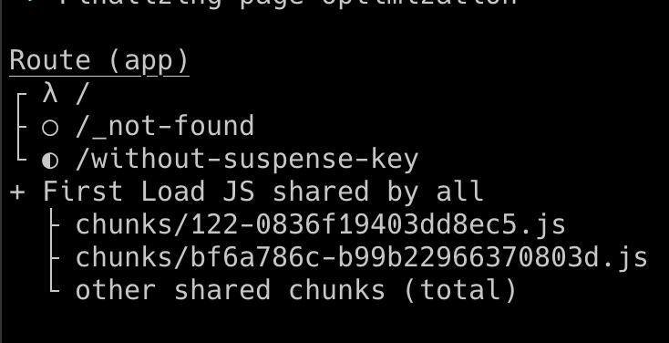

# PPR Suspense Demo

## Issue

I cannot quite figure out how to re-trigger the Suspense boundary with PPR. I see in the docs it says that this will not work with [client side navigation](https://nextjs.org/docs/app/api-reference/next-config-js/partial-prerendering#:~:text=Partial%20Prerendering%20does%20not%20yet%20apply%20to%20client%2Dside%20navigations.), is there any way to re-trigger the suspense?

## What I've Tried

- Calling `router.refresh()` when navigating. Nothing happens that I can see
- Adding a key to the `<Suspense />` `JSON.stringify(searchParams)` whichfixes the issue in local development, but has no effect on the hosted version. This also makes the entire route dynamic, which defeats the purpose of PPR. However, I would take that as a tradeoff if it worked.

I'm open to heavy handed solutions, as the only way I have been able to get this working is with client side fetching with a React Query-esque solution.

## Build Output

Adding `key={JSON.stringify(searchParams)}` makes the home page dynamic, but still doesn't trigger Suspense fallback.

